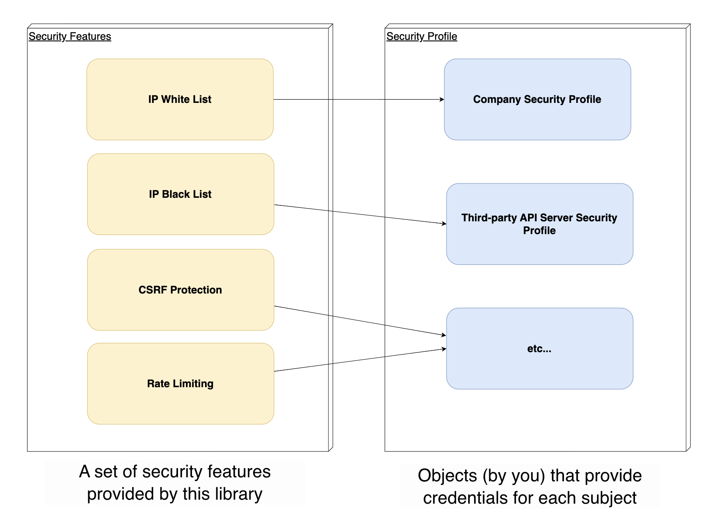
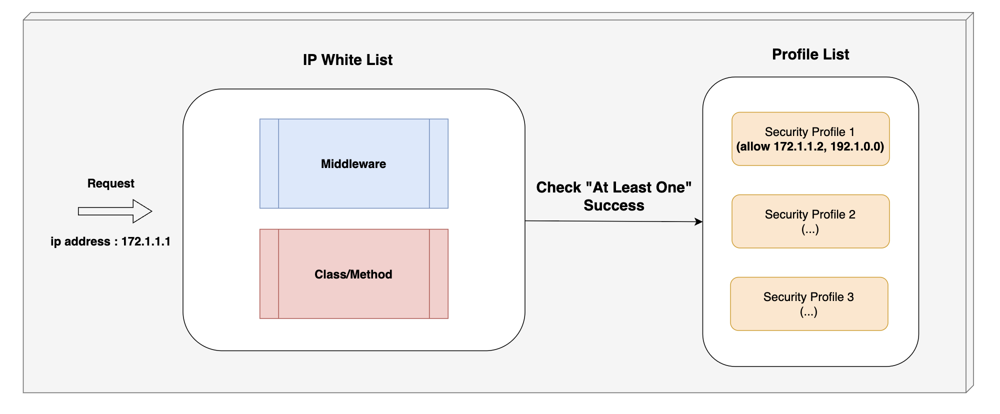
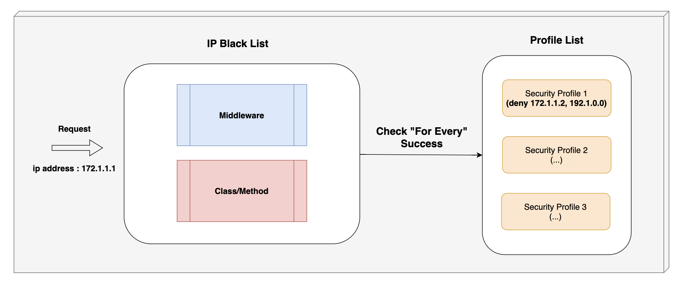

[](https://badge.fury.io/js/angular2-expandable-list)
[](https://github.com/prettier/prettier)

# Nestjs Security

## Table of contents

<!-- @import "[TOC]" {cmd="toc" depthFrom=1 depthTo=6 orderedList=false} -->

<!-- code_chunk_output -->

- [Nestjs Security](#nestjs-security)
  - [Table of contents](#table-of-contents)
  - [Prerequisites](#prerequisites)
  - [Getting Started](#getting-started)
  - [Installation](#installation)
  - [Usage](#usage)
    - [Before use](#before-use)
      - [(1) import SecurityModule](#1-import-securitymodule)
      - [(2) regist security profile](#2-regist-security-profile)
        - [IP white list profile](#ip-white-list-profile)
        - [IP Black list profile](#ip-black-list-profile)
        - [Signed CSRF Token Profile](#signed-csrf-token-profile)
          - [getSessionIDforCreate](#getsessionidforcreate)
          - [getSessionIDforValidate](#getsessionidforvalidate)
          - [getSecretKey](#getsecretkey)
    - [IP White List](#ip-white-list)
      - [Middleware Level](#middleware-level)
      - [Controller or API Method Level](#controller-or-api-method-level)
      - [Validation Failure](#validation-failure)
    - [IP Black List](#ip-black-list)
      - [Middleware Level](#middleware-level-1)
      - [Controller or API Method Level](#controller-or-api-method-level-1)
      - [Validation Failure](#validation-failure-1)
    - [CSRF Protection](#csrf-protection)
      - [Controller or API Method Level](#controller-or-api-method-level-2)
        - [CSRF Token Generate](#csrf-token-generate)
        - [CSRF Token Validate (Check)](#csrf-token-validate-check)
    - [Rate Limiting](#rate-limiting)
  - [Contributing](#contributing)
  - [Error Reports](#error-reports)
    - [Only IPv4](#only-ipv4)
  - [Versioning](#versioning)
  - [Authors](#authors)
  - [License](#license)

<!-- /code_chunk_output -->

<br/>

## Prerequisites

This project requires NodeJS (version 16 or later) and NPM.
[Node](http://nodejs.org/) and [NPM](https://npmjs.org/) are very easy to install. To make sure you have them available on your machine, try running the following command.

```sh
$ npm -v && node -v
6.4.1
v16.1.0
```

If you've encountered an error, please [read it here](#error-reports)

<br/>

## Getting Started

The package was developed under the theme of **"security"** because it wanted to provide a series of functions in one package. Now, we want to provide security features that can be easily applied at the API level, including CSRF protection provided by the deprecated [express/csrf](https://github.com/expressjs/csurf#csurf) package. The core concept is to provide various security functions to be applicable independently of the server infrastructure configuration at the **middleware level, the class level, and the method level** without modifying the business logic.



By default, you can use the security features that the library provides by linking them to a registered security profile.

<br/>

## Installation

<!-- **BEFORE YOU INSTALL:** please read the [prerequisites](#prerequisites) -->

```sh
$ npm install nestjs-security
```

Or if you using Yarn:

```sh
$ yarn add nestjs-security
```

<br/>

## Usage

### Before use

#### (1) import SecurityModule

```typescript
@Module({
  imports: [SecurityModule.forRoot()],
})
export class AppModule {}
```

You must perform `import` on the root module (`AppModule`) to use that package.

<br>

#### (2) regist security profile

The package provides security capabilities based on a provider called **"Security Profile."** Security Profile is a provider that your <u>developer must implement directly</u> and can be implemented by importing and <u>inheriting abstract classes</u> that fit the security features (ex-IP WhiteList) you want to use.

- Security Profile can be **_multiple_** in one application (_Nestjs Server_)
  - _(ex) Multiple profiles that inherit `IpWhiteListValidationSecurityProfile` can be registered_
- Because you are a Nestjs provider by default, you must register as a provider in the appropriate module.
  ```typescript
  @Module({
    imports: [SecurityModule.forRoot()],
    providers: [
      // <-- Register the security profile configured by the developer as a provider.
      NaiveBlackListProfile,
      NaiveWhiteListProfile,
      EnvBlackListProfile,
      EnvWhiteListProfile,
      JwtSignedCSRFTokenProfile,
    ],
  })
  export class AppModule {}
  ```
  In the example above, you have registered with the `AppModule`, but the Security Profile must be registered as a provider in the appropriate module, **depending on the dependencies** required.

The features offered in the current package are the [IP White List](#ip-white-list), the [IP Black List](#ip-black-list), so you must implement a profile for each feature to use. Below, we will discuss how to implement each profile.

<br/>

##### IP white list profile

> **Only the IP addresses in the whitelist are allowed**.

> **Each ip address string supports the [CIDR](https://ko.wikipedia.org/wiki/CIDR) block notation method.**

```typescript
import { ConfigService } from '@nestjs/config';
import {
  IpBlackListValidationSecurityProfile,
  IpWhiteListValidationSecurityProfile,
  SecurityProfileSchema,
} from 'nestjs-security';

@SecurityProfileSchema()
export class NaiveWhiteListProfile extends IpWhiteListValidationSecurityProfile {
  getIpWhiteList(): string[] {
    // return ip's
    return [
      '127.0.0.1',
      /**
       * - start  : 192.168.16.0
       * - end    : 192.168.31.255
       */
      '192.168.16.0/20',
      /**
       * - start  : 192.168.0.5
       * - end    : 192.168.0.5
       */
      '192.168.0.5/32',
    ];
  }
}
```

```typescript
@SecurityProfileSchema()
export class EnvWhiteListProfile extends IpWhiteListValidationSecurityProfile {
  constructor(private readonly configService: ConfigService<any, true>) {
    super();
  }

  getIpWhiteList(): string[] {
    // return ip's from ENV file
    const ipWhiteList = this.configService.get<string>('testIPaddress');
    return [ipWhiteList];
  }
}
```

The IP white list profile inherits the `IpWhiteListValidationSecurityProfile` and is a class with the `@SecurityProfileSchema()` decorator. `getIpWhiteList` should be implemented to return the appropriate IP address arrangement. The `IpWhiteListGuard` or `IpWhiteListMiddleware` that uses that profile is designed to handle **requests pass through** if any of the IpWhiteList in a **given profile matches any one.**

<br/>

##### IP Black list profile

> **Deny all IP addresses in the black list.**

> **Each ip address string supports the [CIDR](https://ko.wikipedia.org/wiki/CIDR) block notation method.**

```typescript
@SecurityProfileSchema()
export class NaiveBlackListProfile extends IpBlackListValidationSecurityProfile {
  getIpBlackList(): string[] {
    return [
      '127.0.0.1',
      /**
       * - start  : 192.168.16.0
       * - end    : 192.168.31.255
       */
      '192.168.16.0/20',
      /**
       * - start  : 192.168.0.5
       * - end    : 192.168.0.5
       */
      '192.168.0.5/32',
    ];
  }
}
```

```typescript
@SecurityProfileSchema()
export class EnvBlackListProfile extends IpBlackListValidationSecurityProfile {
  constructor(private readonly configService: ConfigService<any, true>) {
    super();
  }

  getIpBlackList(): string[] {
    const ipBlackList = this.configService.get<string>('testIPaddress');
    return [ipBlackList];
  }
}
```

The IP Black list profile is a class with the `IpBlackList ValidationSecurityProfileSchema` decorator. `getIpBlackList` should be implemented to return the appropriate IP address arrangement. The `IpBlackListGuard` or `IpBlackListMiddleware` that uses that profile is designed to reject requests if any of all IpBlackList in a given profile matches.

<br/>

##### Signed CSRF Token Profile

> **for Generate CSRF Token and Validate CSRF Token in request**

```typescript
@SecurityProfileSchema()
export class JwtCSRFTokenProfile extends SignedCSRFTokenSecurityProfile {
  getSessionIDforCreate(data: any): string | Promise<string> {
    const accessToken = data?.accessToken;
    const decoded = decode(accessToken) as any;
    return decoded?.jti;
  }

  getSessionIDforValidate(request: Request): string | Promise<string> {
    const accessToken = (request.headers as any).authorization;
    const decoded = decode(accessToken) as any;
    return decoded?.jti;
  }

  getSecretKey(): string | Promise<string> {
    return 'secretKey';
  }
}
```

You must implement a method that contradicts the secret value required to sign the csrf token. For security purposes, the secret must be imported from configService, etc.

###### getSessionIDforCreate

This method is used to automatically include signed CSRFs in the response header by applying the `@Security.GenSignedCSRFToken` decorator. You must implement that method to return a unique value per authentication session.
The **"unique value per session"** is included in the CSRF token to be generated and signed. The CSRF token does not have a separate expiration period and must be naturally incorporated into the life cycle of the session. The example above is an example of returning the JWT token to the Response Body upon successful login.

```typescript
// auth.controller.ts
@Controller('auth')
export class AuthController {
  @Post('login')
  @Security.GenSignedCSRFToken(JwtCSRFTokenProfile)
  login() {
    return {
      accessToken: <<user jwt access token>>,
      ...
    };
  }
}
```

`@Security.GenSignedCSRFToken` calls the getSessionIDforCreate implemented in the JwtCSRFTokenProfile to get a unique value per session to create a CSRF token and include it in the **response header**.

###### getSessionIDforValidate

This method is used to compare the authentication information included when signing a CSRF token on a controller or method with `@Security.CheckSignedCSRFToken()` and the authentication information included in the current request.

```typescript
// post.controller.ts
@Controller('post')
export class PostController {
  @Post()
  @Security.CheckSignedCSRFToken(JwtCSRFTokenProfile)
  createPost(...) {}
}
```

In the above example, `getSessionIDforValidate` is configured to decompose the jwt token in the autorization header of the request object and return the jwtId.

Therefore, `getSessionIDforCreate`, `getSessionIDforValidate` must be implemented to return **"same value"**. However, it is designed to implement two methods separately because the way data is **delivered when returning the credentials to Response and when entering Request may differ**.

###### getSecretKey

The method must be implemented to return the key value to be used to sign the CSRF token. In general, it is best implemented to import from **configService**.

<br/>

> The signed CSRF token shall be signed based on the credentials contained in the request object. When using the JWT-based authentication protocol, one of the following data may be typically selected.

> 1.  JWT Access Token String
> 2.  Claim value unique to each JWT Access token, (e.g [JWT "jti" claim](https://auth0.com/docs/secure/tokens/json-web-tokens/json-web-token-claims))

> If you are using a session-based authentication protocol, it is best to return the session key value.

<br/>

### IP White List



IP White List is a feature used to allow requests that come to a specific IP address only.

- If you want to restrict IP-based access to resources provided by a particular controller
- If you want to dynamically configure IP WhiteList across the Admin Server
  - The package's security profile allows you to dynamically configure IP WhiteList by **establishing DB connections, Redis connections**.

<br/>

#### Middleware Level

```typescript
import { IpWhiteListMiddleware } from 'nestjs-security';

@Module({
  imports: [],
  controllers: [UserController],
  providers: [],
})
class UserModule {
  configure(consumer: MiddlewareConsumer) {
    consumer
      .apply(
        IpWhiteListMiddleware.allowProfiles(PrivateIPWhiteListProfile, AdminWebIPWhiteListProfile),
      )
      .forRoutes(UserController);
  }
}
```

The middleware registration usage is the same as the custom middleware registration method in [Nestjs official document](https://docs.nestjs.com/middleware). Using `IpWhiteListMiddleware.allowProfiles()`, deliver the security profile you want to handle with the middleware you previously registered as a provider.

<br/>

#### Controller or API Method Level

```typescript
// method level
@Controller()
class TestController {
  @Get()
  @Security.CheckIpWhiteList(NaiveWhiteListProfile)
  allowSingleProfile() {
    return true;
  }
}

// class level
@Controller()
@Security.CheckIpWhiteList(NaiveWhiteListProfile, EnvWhiteListProfile)
class TestController {
  @Get()
  allowSingleProfile() {
    return true;
  }
}
```

If you want to apply a detailed IP White List check on an **API endpoint or controller basis**, you can use `@Security.CheckIpWhiteList()` to apply it to any controller or method you want. Similarly, you can forward a SecurityProfile to set which security profile you want to apply.

<br/>

#### Validation Failure

The IP Whitelist returns an error if all applied IpWhiteListProfiles do not pass regardless of where the middleware, class/method level is applied, which means **"Request for an IP address that is not allowed."** The error object is organized as follows, which can be found here.

> NOTE: White List successfully handles at least one security profile if it is applied. _(at-least-one)_

```typescript
export class ForbiddenIpAddressError extends SecurityModuleError {
  constructor(profileName: string, ipAddress: string) {
    super(`Forbidden IP address: ${ipAddress}, profile name: ${profileName}`, HttpStatus.FORBIDDEN);
  }
}
```

<br/>

### IP Black List



Use the IP Black List to **reject requests** that come to a **specific IP address**, which is appropriate for security rules that allow you to reject certain IPs but allow all other requests.

- If you want to dynamically (in real time) **block certain IPs urgently**
- If you want to dynamically configure an IP Black List across the Admin server
  - The package's security profile allows you to dynamically configure an IP Black List by building a **DB connection, a Redis connection.**

As with the IP White List, these features are provided separately by (1) using it for batch application at the middleware level and (2) using it for application at the controller class or API method level.

<br/>

#### Middleware Level

```typescript
import { IpBlackListMiddleware } from 'nestjs-security';

@Module({
  imports: [],
  controllers: [UserController],
  providers: [],
})
class UserModule {
  configure(consumer: MiddlewareConsumer) {
    consumer
      .apply(
        IpBlackListMiddleware.allowProfiles(PrivateIPWhiteListProfile, AdminWebIPWhiteListProfile),
      )
      .forRoutes(UserController);
  }
}
```

The middleware registration usage is the same as the custom middleware registration method in [Nestjs official document](https://docs.nestjs.com/middleware). Using `IpBlackListMiddleware.allowProfiles()`, deliver the security profile you want to handle with the middleware you previously registered as a provider.

<br/>

#### Controller or API Method Level

```typescript
// method level
@Controller()
class TestController {
  @Get()
  @Security.CheckIpBlackList(NaiveBlackListProfile)
  allowSingleProfile() {
    return true;
  }
}

// class level
@Controller()
@Security.CheckIpBlackList(NaiveBlackListProfile)
class TestController {
  @Get()
  allowSingleProfile() {
    return true;
  }
}
```

If you want to apply a detailed IP White List check on an **API endpoint or controller basis**, you can use `@Security.CheckIpBlackList()` to apply it to any controller or method you want. Similarly, you can forward a SecurityProfile to set which security profile you want to apply.

<br/>

#### Validation Failure

The IP BlackList returns an error if one of applied IpBlackListSecurityProfile do not pass regardless of where the middleware, class/method level is applied, which means **"Request for an IP address that is denied."** The error object is organized as follows, which can be found here.

> NOTE: Black List successfully handles all of security profile if it is applied. _(for-every)_

```typescript
export class ForbiddenIpAddressError extends SecurityModuleError {
  constructor(profileName: string, ipAddress: string) {
    super(`Forbidden IP address: ${ipAddress}, profile name: ${profileName}`, HttpStatus.FORBIDDEN);
  }
}
```

<br/>

### CSRF Protection

The package provides the ability to defend [CSRF](https://en.wikipedia.org/wiki/Cross-site_request_forgery) . The CSRF defense capabilities currently available are based on the CSRF tokens signed by the HMAC algorithm, including the authentication information contained in the session or JWT.

The package must be implemented by the developer in [SignedCSRFTokenSecurityProfile](#signed-csrf-token-profile) to ensure security so that one of the following values is included in the CSRF token.

- A session-dependent value that changes with each login session
- A random value (e.g. UUID) within a JWT that changes every time a JWT is created.

The package provides additional security features for CSRF tokens, including random numbers and timestamp.

<br/>

#### Controller or API Method Level

##### CSRF Token Generate

```typescript
// auth.controller.ts
@Controller('auth')
export class AuthController {
  @Post('login')
  @Security.GenSignedCSRFToken(JwtCSRFTokenProfile) // set response.header['x-csrf-token']
  login() {
    return {
      accessToken: <<user jwt access token>>,
      ...
    };
  }
}
```

Create a CSRF token using `@Security.GenSignedCSRFToken` and automatically include the CSRF token you created in the **'x-csrf-token'** response header. Both method level and class level are available.
You can easily issue CSRF tokens just by applying the decorator, but you need to configure the **controller method knowing that the return value** of the method with the decorator applied is delivered by the argument of `getSessionIDforCreate` in `SignedCSRFTokenSecurityProfile`.

<br/>

##### CSRF Token Validate (Check)

```typescript
// post.controller.ts
@Controller('post')
@Security.CheckSignedCSRFToken(JwtCSRFTokenProfile) // validate csrf token
export class PostController {
  @Post()
  createPost(...) {}
}
```

You can use `@Security.CheckSignifiedCSRFToken` to import and verify the **CSRF token contained in the 'x-csrf-token' request header.** The token is a value hashed into the HMAC algorithm based on the value returned by the `getSecretKey` in the `SignedCSRFTokenSecurityProfile`, so it cannot be forged by an attacker unless you know the `getSecretKey`.
You can also verify that the person who issued the CSRF token sent the request by **comparing the authentication information** returned by the `getSessionIDforValidate` in the `SignedCSRFSecurityProfile` with the authentication information contained in the current CSRF token.

<br/>

<br/>

### Rate Limiting

> NOTE : It will be added to the next version.

<br/>

## Contributing

Any additional feature suggestions or error reports and PRs for correcting existing features are **all welcome**!

1.  Fork it!
2.  Create your feature branch: `git checkout -b my-new-feature`
3.  Add your changes: `git add .`
4.  Commit your changes: `git commit -am 'Add some feature'`
5.  Push to the branch: `git push origin my-new-feature`
6.  Submit a pull request :sunglasses:

<br/>

## Error Reports

### Only IPv4

Currently, the ipWhiteList and ipBlackList features support only ipv4 address formats. We will provide future versions to automatically distinguish between ipv6 and ipv4 address formats. Therefore, for nestjs systems that do not require an ipv6 address scheme, setting it as [below](<https://nodejs.org/dist/latest-v4.x/docs/api/http.html#http_server_listen_port_hostname_backlog_callback:~:text=listen(path).-,server.listen(%5Bport%5D%5B%2C%20hostname%5D%5B%2C%20backlog%5D%5B%2C%20callback%5D),-%23>) can resolve most incorrect behavior.

```typescript
// main.ts
await app.listen(3000, '0.0.0.0');
```

<br/>

## Versioning

We use [SemVer](http://semver.org/) for versioning. For the versions available, see the [tags on this repository](https://github.com/your/project/tags).

<br/>

## Authors

- **Kim Beob Woo** - _Initial work_ - [KimBeobWoo](https://github.com/KIMBEOBWOO)

See also the list of [contributors](https://github.com/your/project/contributors) who participated in this project.

<br/>

## License

[MIT License](https://andreasonny.mit-license.org/2019)

<br/>
